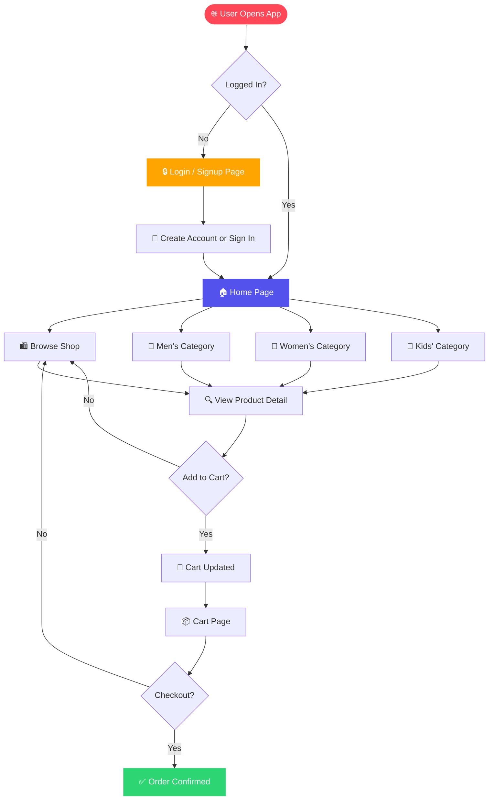
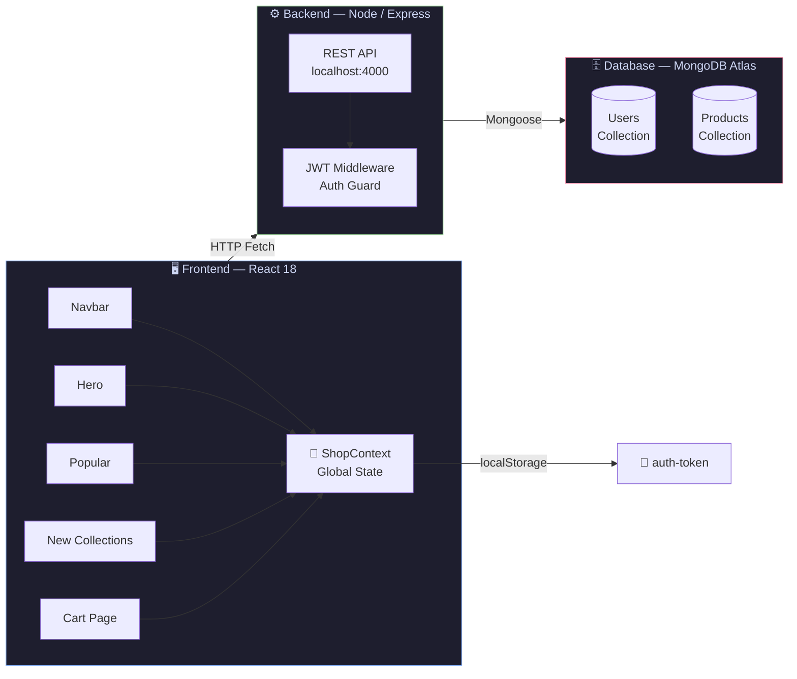
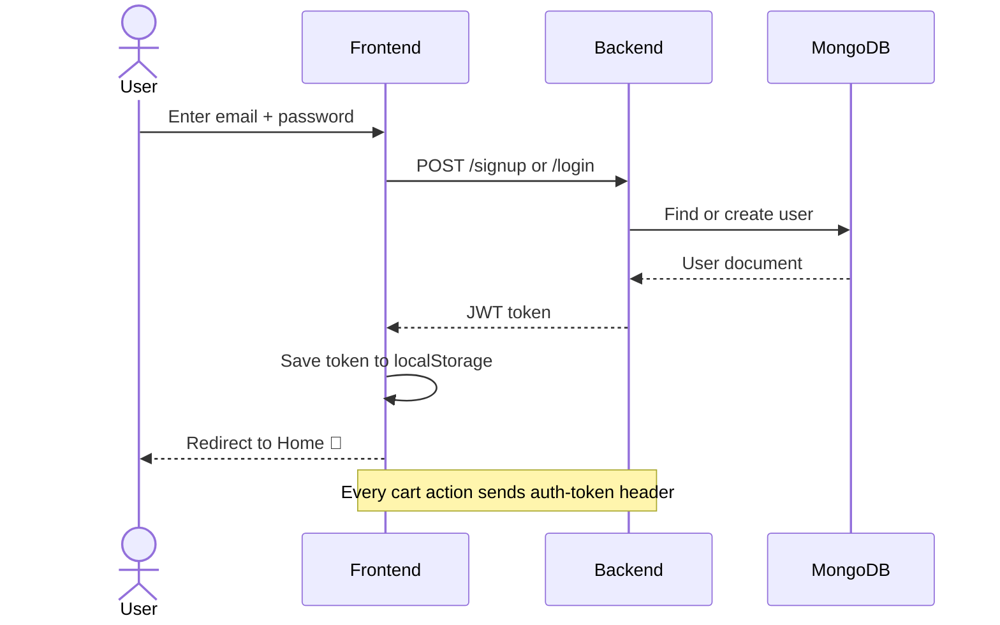
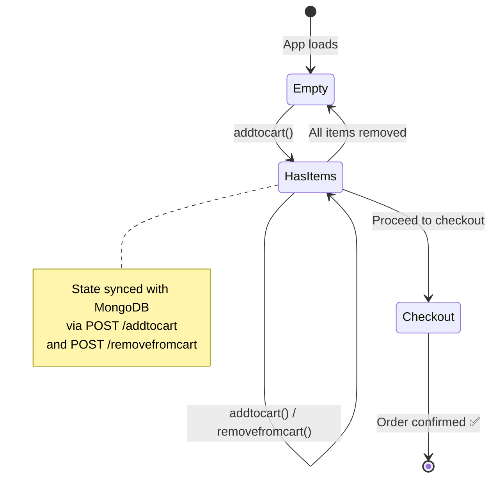
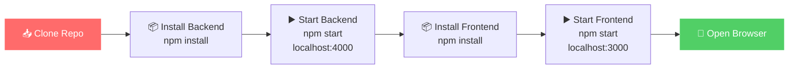
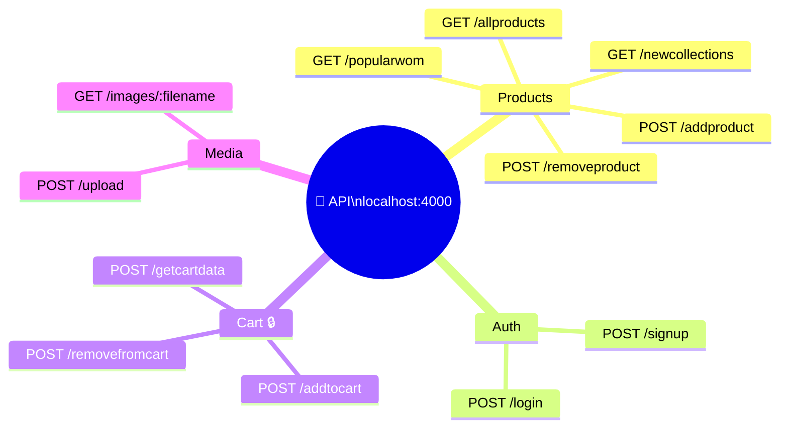
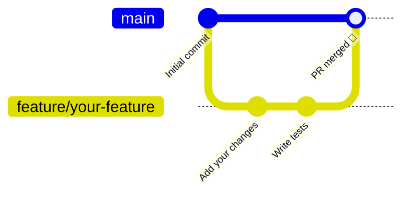

<div align="center">

```
███╗   ██╗███████╗██╗  ██╗██╗   ██╗███████╗
████╗  ██║██╔════╝╚██╗██╔╝██║   ██║██╔════╝
██╔██╗ ██║█████╗   ╚███╔╝ ██║   ██║███████╗
██║╚██╗██║██╔══╝   ██╔██╗ ██║   ██║╚════██║
██║ ╚████║███████╗██╔╝ ██╗╚██████╔╝███████║
╚═╝  ╚═══╝╚══════╝╚═╝  ╚═╝ ╚═════╝ ╚══════╝
         C O M M E R C E
```

### 🛍️ A full-stack e-commerce platform built for speed, style, and scale


</div>

---

## ⚡ What is NexusCart?

NexusCart is a modern, animated full-stack e-commerce app. Browse products by category, manage your cart in real-time, and checkout — all with smooth animations and a clean UI.

---

## 🗺️ App Flow



---

## 🏗️ System Architecture



---

## 🔐 Auth Flow



---

## 🛒 Cart State Flow



---

## 📁 Project Structure

```
Nexus-Commerce/
│
├── 🎨 frontend/
│   ├── src/
│   │   ├── Components/
│   │   │   ├── 🧭 Navbar/          ← Sticky animated navbar
│   │   │   ├── 🦸 Hero/            ← Floating hero with blobs
│   │   │   ├── 🔥 Popular/         ← Women's trending products
│   │   │   ├── ✨ New collections/ ← Latest drops
│   │   │   ├── 🎁 Offers/          ← Gradient promo banner
│   │   │   ├── 📧 Newsletter/      ← Email subscribe
│   │   │   ├── 🛒 Cartpage/        ← Animated cart UI
│   │   │   ├── 📦 Productdisplay/  ← Product detail view
│   │   │   └── 🏷️ Item/            ← Product card with hover
│   │   ├── Context/
│   │   │   └── ShopContext.jsx     ← Global state (cart + products)
│   │   └── Pages/
│   │       ├── Shop.jsx
│   │       ├── ShopCategory.jsx
│   │       ├── Product.jsx
│   │       ├── Cart.jsx
│   │       └── LoginSignup.jsx
│   └── package.json
│
└── ⚙️ backend/
    ├── index.js                    ← Express server + all routes
    ├── upload/images/              ← Product image uploads
    └── package.json
```

---

## 🚀 Getting Started



```bash
# 1. Clone
git clone https://github.com/achalcipher/Nexus-Commerce.git

# 2. Backend
cd Nexus-Commerce/backend
npm install
npm start          # → running on :4000

# 3. Frontend (new terminal)
cd Nexus-Commerce/frontend
npm install
npm start          # → opens on :3000
```

---

## 🔌 API Reference



> 🔒 Cart routes require `auth-token` header (JWT)

---

## 🎨 Tech Stack at a Glance

| Layer | Tech | Purpose |
|-------|------|---------|
| 🖼️ UI | React 18 + Tailwind | Component-based UI |
| 🎬 Animations | Framer Motion | Page & hover animations |
| 🔀 Routing | React Router v6 | Client-side navigation |
| 🔔 Toasts | React Hot Toast | User feedback |
| ⚙️ Server | Express.js | REST API |
| 🔐 Auth | JWT | Stateless authentication |
| 🗄️ Database | MongoDB Atlas | Cloud NoSQL storage |
| 📁 Uploads | Multer | Product image handling |

---

## 🤝 Contributing



1. Fork the repo
2. Create your branch: `git checkout -b feature/cool-thing`
3. Commit: `git commit -m "feat: add cool thing"`
4. Push: `git push origin feature/cool-thing`
5. Open a Pull Request

---

<div align="center">

Made with ❤️ by [achalcipher](https://github.com/achalcipher)

⭐ Star this repo if you found it useful!

</div>
